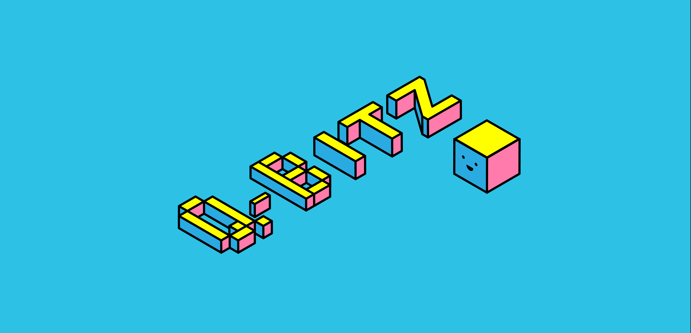

# CS319 - Project

Project repository for CS319 Object-Oriented Software Engineering - Fall 2018  
- Group Number: 1B  
- Group Name: QED  
- Project Name: Q-bitz

# Team Members
- Sait Aktürk  
- Zafer Tan Çankırı  
- Berkin Inan  
- Halil Şahiner  
- Abdullah Talayhan

# Original Q-bitz Description
 Q-bitz is a puzzle game in which players try to recreate the patterns using cubes.
The game has several different playing modes. 

## Game Modes

### Race Mode

At this round, players will be racing with each other to recreate the pattern shown on the Q-bitz card drawn to start the game by using the set of cubes that can be rotated. The race will be started when the card is shown to players. Player can submit the pattern that created to win the game. In practice mode, players will recreate the pattern with a timer on the screen. How much time they use for each card will be shown in a local scoreboard to see how they are doing.

  

### Roll to Win Mode

All cubes are rolled and players try to recreate the pattern on the card without rotating the cubes. When the player decides the cubes that rolled cannot be used for recreating the pattern more, the cubes can be rolled again without a limitation of number of rolling. Players can submit their work to win the game.

  
### Memory Mode

Players have 10 seconds to memorize the pattern on the Q-bitz card. Players then try to recreate the pattern from their memory with the set of cubes that can be rotated. Players who have recreated the pattern correctly, wins the round.

# Our variant of Q-Bitz
While including the features in the original game, our variant has several additional features.

## Additional Features
### Different Board Sizes
Originall Q-bitz consists of blocks in a 4x4 grid, our game will have the options for changing this to either 3x3 or 5x5. This will be a convenient feature for setting the difficulty of the game.
### Single Player Mode
A player can use this mode to practice individual skills and to have an arcade type of game experience. It consists of back to back rounds of the game which has increasing level of diffuclty.
### Elimination Mode
This mode is only valid for multiplayer games. Since the game is digital and we can have many boards instead of four in the original one. Several players (more than 4) can join to the same game room and start a tournament. In each game, the slowest player will be eliminated.

## Future Plans (Not Mandatory)

 - [ ] Extreme Mode: Creating a 3D pattern using different type of pieces.
 - [ ] Image Recreation: Creating a famous image like Mona Lisa instead of the original Q-bitz patterns. 

## References
[Q-Bitz Official Rules
](http://www.boardgamecapital.com/game_rules/q-bitz.pdf)
